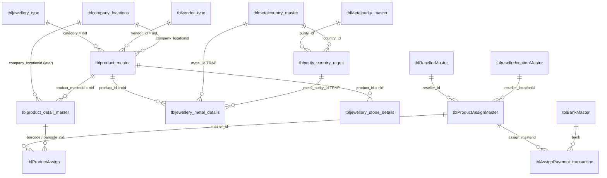
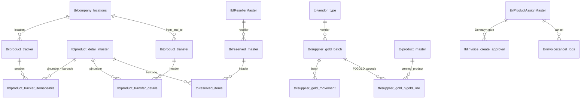
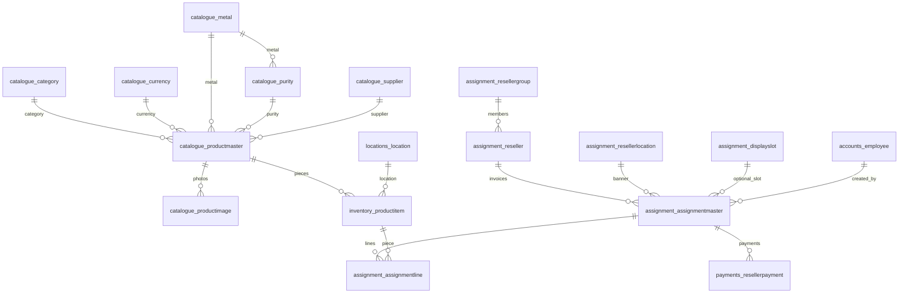

# How both Perfect Jewel databases work

A reading guide for the **live iadmin** database (`stock_rfid` on SQL Server) and the **Django rebuild** database (Postgres: `pj_erp_dev` / `pj_erp_prod` locally, `pj_erp_db` on Render).

This is the “absorb both schemas” document. It does **not** replace:

| File / page | What that one is |
|-------------|------------------|
| [`DATABASE.md`](DATABASE.md) | How to switch local Postgres catalogs (`dev` vs `prod` snapshot) |
| `/dev/data-map/` | In-app explanation of the four stores (live SQL, local Postgres, Render, DATAFILE sheet) |
| `/dev/db-workbench/` | Click a live table, see columns and joins |
| Dual-repo audit (`ftp…/docs/dual-repo-audit/`) | Feature parity A vs B, not a schema tutorial |

Written 11 Sep 2026 from the models, views, iadmin pages, and the known joins the reports/sync actually use.

---

## 1. Picture in one minute

Staff still run the business in **iadmin** (ASP.NET + SQL Server `stock_rfid`). Django is a rewrite that **copies** that data into Postgres (one-way sync). Django does not write back.

```
  iadmin pages  ──write──►  SQL Server stock_rfid   (system of record today)
                                  │
                                  │  sync_legacy_mssql  (read only)
                                  ▼
  Django pages  ──read/write──►  Postgres  (local + Render)
```

Two catalogs, **same jewellery story**, different shape:

| | Live iadmin | Django |
|--|-------------|--------|
| Engine | SQL Server, ~72–80 tables, **zero real foreign keys** | Postgres, ~30 domain tables, **real FKs** |
| Identity column | `nid` on almost everything | `id` (Django PK) plus `legacy_id` = the old `nid` |
| Status | Free-text `sold_status` (`pending` / `assign` / `sold`) | Enum: `PENDING` / `ASSIGNED` / `RESERVED` / `SOLD` |
| Location of a piece | Originally on the **design**; later also on the **piece** | Only on the **piece** |
| Invoice | Columns on the assignment header — no invoice table | Same idea: columns on `AssignmentMaster` |

If you remember only one sentence: **a design is not a barcode, and an invoice is not a separate document — it is a stamped assignment.**

---

## 2. The one idea you need

Jewellery data has four layers. Both databases store them. Names differ.

```
  LOOKUPS          type of jewellery, supplier, currency, company site, metal/purity
       │
  DESIGN           one style / SKU  (many pieces can share it)
       │
  PIECE            one physical item = one barcode = one RFID tag  (PJ23380)
       │
  COMMERCIAL       who it was assigned to, the invoice, payments, return/sold
```

Walk one real item in your head: style **ANICH1**, barcode **PJ23380**.

1. **Design** holds the name, supplier, selling price, consignment dates.
2. **Piece** holds the barcode, where it sits (HO / showroom / …), and whether it is company stock, assigned, reserved, or sold.
3. **Metal row** (iadmin only as its own table) holds the gram weight reports print. Django copies the *number* onto the design (`gold_weight` / `net_weight`).
4. If a reseller took it, an **assignment header** (invoice `RE…` or reserve `RN…`) plus a **line** pointing at that barcode. Payments hang off the header. A return later writes a return row and flips the piece status.

That is the whole operational spine. Tracker, transfer, gold batches, HR, and hotel leftovers sit beside it.

---

## 3. How to read the ERDs

Arrows mean “this row points at that row.”

- **iadmin:** the database does **not** enforce those arrows. Code and stored procedures join on integers that *happen* to match `nid`. The same integer `1` can mean Silver, 24K, or 18K-Japan Gold depending on which lookup table you open. Those are marked **trap** below.
- **Django:** arrows **are** foreign keys. You cannot point a piece at a location that does not exist.

`nid` / `legacy_id` is how sync matches a Django row back to its iadmin twin.

---

## 4. ERD — live iadmin (`stock_rfid`)

Logical joins only. No FKs in SQL Server.

### 4.1 The jewellery spine (what you look at every day)



### 4.2 Count, move, reserve, gold (still iadmin)



### 4.3 What each spine table actually holds

| Table | One row is… | Key columns you will see on screen |
|-------|-------------|------------------------------------|
| `tblproduct_master` | A **design** (style / SKU) | `nid`, `reference_id`, `product_Name`, `category`, `vendor_id`, `selling_price`, `product_type`, `purchase_date`, `due_date`, `company_locationid` |
| `tblproduct_detail_master` | A **physical piece** | `nid`, `product_masterid`, `barcode_number` (PJ code), `sold_status`, `company_locationid` |
| `tbljewellery_metal_details` | Gram/weight line for a design | `product_id`, `weight`, `metal_id`, `metal_purity_id` |
| `tbljewellery_stone_details` | Stone/diamond line | `product_id`, `weight`, `stone_subcat_id` |
| `tblProductAssignMaster` | An **invoice header** | `nid`, `reseller_id`, `invoice_number` (`RE00…` / `RN00…`), `invoice_status`, `payment_status` |
| `tblProductAssign` | One barcode on that invoice | `master_id`, barcode / `barcode_nid` (sometimes a CSV of detail `nid`s), prices |
| `tblAssignPayment_transaction` | Money against that invoice | `assign_masterid`, amount, date, bank |
| `tblResellerMaster` | The customer | `nid` printed as “Res No.” |
| `tblcompany_locations` | A Perfect Jewel site (HO, showroom) | `nid`, `location_code` (`HO` is hardcoded in many pages) |
| `tblvendor_type` | Supplier | `nid` ← `product_master.vendor_id` |

**There is no `tblinvoice`.** Stamping `ResellerPaymentInvoice.aspx` writes `invoice_number` / `invoice_status` onto `tblProductAssignMaster`.

---

## 5. ERD — Django (Postgres)

Enforced foreign keys. Table names are `{app}_{model}` in lowercase.

### 5.1 The jewellery spine



### 5.2 Count, move, return, print

```mermaid
erDiagram
    locations_location ||--o{ tracker_trackersession : where
    tracker_trackersession ||--o{ tracker_trackersession : "closing → opening"
    tracker_trackersession ||--o{ tracker_trackerscanitem : scans
    inventory_productitem ||--o{ tracker_trackerscanitem : piece
    locations_location ||--o{ transfers_transfer : from
    locations_location ||--o{ transfers_transfer : to
    transfers_transfer ||--o{ transfers_transferline : lines
    inventory_productitem ||--o{ transfers_transferline : piece
    inventory_productitem ||--o{ returns_returnrecord : piece
    assignment_assignmentline ||--o{ returns_returnrecord : which_invoice_line
    inventory_productitem ||--o{ returns_reservealert : due_alert
    inventory_productitem ||--o{ hardware_labelprintlog : printed
    hardware_labeltemplate ||--o{ hardware_labelfield : layout
    hardware_labeltemplate ||--o{ hardware_labelprintlog : template
    accounts_employee ||--o{ core_auditlogentry : actor
```

### 5.3 What each spine table actually holds

| Postgres table | Django model | One row is… | Sync twin |
|----------------|--------------|-------------|-----------|
| `catalogue_productmaster` | `ProductMaster` | A design | `tblproduct_master` |
| `inventory_productitem` | `ProductItem` | A barcode / piece | `tblproduct_detail_master` |
| `locations_location` | `Location` | Company site | `tblcompany_locations` |
| `catalogue_category` | `Category` | Jewellery type (JW / ST / …) | `tbljewellery_type` |
| `catalogue_supplier` | `Supplier` | Supplier | `tblvendor_type` |
| `assignment_reseller` | `Reseller` | Customer | `tblResellerMaster` |
| `assignment_assignmentmaster` | `AssignmentMaster` | Invoice header | `tblProductAssignMaster` |
| `assignment_assignmentline` | `AssignmentLine` | One piece on an invoice | `tblProductAssign` |
| `payments_resellerpayment` | `ResellerPayment` | Payment on an invoice | `tblAssignPayment_transaction` |
| `catalogue_productimage` | `ProductImage` | Photo of a design | **not synced** (R2 / local media) |
| `catalogue_productintakebatch` | `ProductIntakeBatch` | One Excel / one-piece drop | `tblUploadexcel_list` |
| `catalogue_productintakeline` | `ProductIntakeLine` | One PJ from that drop | `tblproduct_detail_master.excel_id` |

Piece status machine (Django only — the database will reject a nonsense jump):

```
  PENDING ──► ASSIGNED ──► SOLD
     │            │
     │            ├──► RESERVED
     │            └──► PENDING   (plain return)
     └──► RESERVED / IN_TRANSIT  (IN_TRANSIT is defined, almost never written)
```

Location lives **only** on `inventory_productitem`. Moving PJ23380 cannot drag every other ANICH1 barcode with it. That was a real iadmin bug: transfers used to write `tblproduct_master.company_locationid` (the shared design).

---

## 6. Same thing, two names

| What staff mean | iadmin table / column | Django table / field |
|-----------------|----------------------|----------------------|
| Style / design | `tblproduct_master` | `catalogue_productmaster` |
| PJ barcode | `tblproduct_detail_master.barcode_number` | `inventory_productitem.barcode` |
| In stock at HO | detail `sold_status` ≈ pending + location | `status=PENDING` + `location` |
| On a reseller | `sold_status` ≈ assign | `status=ASSIGNED` |
| Sold | `sold_status` ≈ sold | `status=SOLD` |
| Invoice | `tblProductAssignMaster` (`RE00`+nid) | `assignment_assignmentmaster` (`RE`/`RN` + id) |
| Invoice line | `tblProductAssign` | `assignment_assignmentline` |
| Payment | `tblAssignPayment_transaction` | `payments_resellerpayment` |
| Supplier | `tblvendor_type` | `catalogue_supplier` |
| Company site | `tblcompany_locations` | `locations_location` |
| Reseller (customer) | `tblResellerMaster` | `assignment_reseller` |
| Invoice banner | `tblresellerlocationMaster` | `assignment_resellerlocation` |
| Display case / “room” | `tblRoomMaster` + allotment | `assignment_displayslot` |
| Tracker session | `tblproduct_tracker` | `tracker_trackersession` |
| Tracker scan line | `tblproduct_tracker_itemsdeatils` | `tracker_trackerscanitem` |
| Transfer | `tblproduct_transfer` + `_details` | `transfers_transfer` + `transferline` |
| Staff login | `tblemployee` (plaintext password) | `accounts_employee` (hashed) |
| Gram weight | `tbljewellery_metal_details.weight` | `productmaster.gold_weight` / `net_weight` |
| Karat label | overlapping metal ids + DATAFILE sheet | `metal` / `purity` FKs (often still thin after sync) |
| Gold batch / PJGOLD | `tblsupplier_gold_*` | **not modeled** (barcode series only on dashboard) |
| Donnalyn invoice gate | `tblinvoice_create_approval` | **not modeled** |
| Print history | (none) | `hardware_labelprintlog` |
| Audit trail | ViewState / `tblsitelog` | `core_auditlogentry` |

---

## 7. What tables show on which **iadmin** page

Path is `/iadmin/<file>` unless noted. **Multi** = the page joins more than one table (almost every ops page does).

### 7.1 Daily jewellery loop

| Menu / page | File | Tables it reads | Tables it writes | Multi? | What you see |
|-------------|------|-----------------|------------------|--------|--------------|
| Sign in | `login.aspx` | `tblemployee` | `tblsitelog` | mild | Login |
| Dashboard | `adminhome.aspx` | detail, assign, tracker, transfer, gold | — | **yes** | Counts: stock, unpaid invoices, gold grams |
| Product Master | `ProductMaster.aspx` | master, detail, metal/stone/diamond/finding, type, subcat, vendor, purity/country, currency | master + detail + jewellery extension rows | **yes** | Catalogue list / edit / prices |
| Excel upload | `website_product_reference.aspx` | vendor, metal, purity, detail | upload list + products | **yes** | Jewellery Excel → designs + pieces |
| Print barcodes | `PrintBarcode.aspx` | master/detail via `sp_printbarcode` | — | **yes** (inside SP) | Zebra / RFID label |
| Product Tracker | `product_tracker_new.aspx` | tracker, tracker items, detail, locations, assign, reserved, vendor | tracker + items; may call transfer | **yes** | Opening / closing / check / transfer scan |
| Product Transfer | `ProductTransfer.aspx` + `ProductTransferList.aspx` | transfer, details, locations, master/detail | transfer header/lines + location on master (and detail in active-sync) | **yes** | Move stock. Return-transfer button is empty |
| Location stock | `locationbase_stock.aspx` | master, detail, locations, lookups | — | **yes** | Counts by site |
| RFID Scan | `Rfid_scan.aspx` | reseller, rooms, master/detail, gold, rfid sync | assign + detail status + gold issue | **yes** | Assign / sold / return / PJGOLD by scan |
| Product Assign | `productassign.aspx` | assign master/lines, master/detail, reseller*, rooms, reserved, safehouse, gold, payments | assign master/lines, detail `sold_status`, barcode logs, rooms, approval queue | **yes** | Create/edit RE invoice |
| Stamp invoice / PDF | `ResellerPaymentInvoice.aspx` | assign master, reseller, discount | invoice columns on assign master | **yes** | `RE00`/`RN00` stamp |
| Pay invoice | `assign_paymentpage.aspx` | banks, assign | `tblAssignPayment_transaction` | **yes** | Reseller payment |
| Supplier / product pay | `payment_page.aspx` | banks | `tblpayment_transaction` | **yes** | Parallel pay UI |
| Return / sold | `ProductReturn.aspx` | assign lines, master/detail | detail status, assign return fields, reserved | **yes** | Sold vs return vs reserve |
| Invoice approval | `invoice_create_approval.aspx` | `tblinvoice_create_approval` | approve inserts assign | **yes** on approve | Donnalyn / L'Esperance queue |
| Cancel approval | `invoicecancel_approval.aspx` | cancel logs, assign, reseller | cancel logs + reverse stock | **yes** | Whole/partial cancel |
| Discount approval | `admindiscount_approvmaster.aspx` | discount, assign, reseller | discount status | **yes** | Pending % |
| Supplier Gold | `supplier_gold_stock.aspx` | gold batch, movement, vendor | batch balance, movements | **yes** | Lots, grams, rates |
| Reserve master | `reserve_itemmaster.aspx` | reserved + product | `tblreserved_master` | **yes** | Hold for a reseller |
| Consignment due | `consignment_alert_master.aspx` | product due dates | — | mild | Overdue consignment lots |
| Safe house | `product_safe_house.aspx` | master, detail, safehouse, vendor | `tblproduct_safehouse`, `tblsafehouse_log` | **yes** | Items moved off floor |

### 7.2 Masters staff actually open

| Page | File | Main table |
|------|------|------------|
| Supplier Master | `VendorMaster.aspx` | `tblvendor_type` |
| Reseller Master | `ResellerMaster.aspx` | `tblResellerMaster` |
| Reseller Location | `reselllerlocationmaster.aspx` | `tblresellerlocationMaster` |
| Location mapping | `Resellerlocationmapping.aspx` | mapping + reseller + location |
| Company locations | `company_locations.aspx` | `tblcompany_locations` |
| Room allotment | `RoomAllotmentMaster.aspx` / `RoomMaster.aspx` | rooms (display slots on assign) |
| Bank | `BankMaster.aspx` | `tblBankMaster` |
| Currency | `currency_converter_master.aspx` | `tblcurrency_converter` |
| Metal / purity / rates | `Metalcountrymaster.aspx`, `Metalpuritymaster.aspx`, `Metalcountry_puritymapping.aspx`, `Metalcountry_purityRate.aspx` | metal country, purity, combo, rate |
| Category / size / stone | `jewellery_category.aspx`, `jewellery_sub_category.aspx`, `JewellerySize.aspx`, `stone_sub_category.aspx` | type, subcat, size, stone subcat |
| Group (invoice logos) | `Groupmaster.aspx` | `tblGroupmaster` |

### 7.3 Reports (read many tables, write rarely)

| Page | Core tables |
|------|-------------|
| `stocknewreport.aspx` | product + metal details via `sp_stock_new_report` (treat as may-mutate) |
| `StockReport.aspx` | master, detail, safehouse, reserved, vendor |
| `stock_audit_report.aspx` | master, detail, assign |
| `daywise_stockreport.aspx` | master, detail, assign, reserved, safehouse |
| `SaleByReseller.aspx` / `SaleByStock.aspx` | assign + reseller + master |
| `ProductAssignReport.aspx` | assign + reseller location |
| `ProductReturnReport.aspx` | assign + reseller |
| `accounting_report.aspx` | assign, payments, consignment, vendor, product |
| `Reseller_paymentReport.aspx` | assign + payment tx + `tblinvoice_data` |
| `SupplierReport.aspx` / `Supplierdetailreport.aspx` | vendor + product |
| `SafeHouseReport.aspx` | safehouse + product |
| `roomallotment_newreport.aspx` | assign + room + reseller |

Almost every report is **multi-table**. That is why a stock report karat can disagree with Product Master: they join different purity tables.

### 7.4 Heaviest multi-table pages (iadmin)

These are the ones that stitch the whole spine in one request:

1. **Product Master** — design + pieces + metal + stone + lookups.
2. **Product Assign / RFID Scan** — reseller + rooms + pieces + gold + payments.
3. **Product Tracker** — scans vs expected stock vs assigned/reserved.
4. **Dashboard** — counts across stock, invoices, tracker, gold.
5. **Accounting / stock-new reports** — product + metal + assign + pay.

---

## 8. What tables show on which **Django** page

Nav from `templates/base.html`. Postgres names below.

Header chrome (every page): `catalogue_productmaster` (consignment due bell) and `returns_reservealert`.

### 8.1 Staff pages

| Nav / URL | Page | Tables read | Tables written | Multi? | What you see |
|-----------|------|-------------|----------------|--------|--------------|
| `/accounts/login/` | Sign in | `accounts_employee` | session | no | Login by employee code |
| `/` | Dashboard | items, products, categories, locations, resellers, invoices, lines, payments, tracker, transfers, reserve alerts | — | **yes** | Mix, values, rankings, latest PJ/PJGOLD, dues |
| `/search/` | Search | items, products, locations, resellers, groups, invoices | — | **yes** | Exact barcode → piece page |
| `/products/` | Products | products + lookups + images, item counts, categories, suppliers | — | **yes** | Design list; consignment chips |
| `/products/<id>/` | Product detail | product + FKs, items + location | — | **yes** | Spec + pieces |
| `/products/item/<barcode>/` | Piece detail | item + product + location, `core_auditlogentry`, sibling items | — | **yes** | Scan landing + history |
| `/products/add/` | Add stock | locations; intake batches | products, items, intake batch/lines; may create lookups | **yes** | Excel template + upload + history |
| `/products/add/history/<id>/` | Upload history | intake batch + lines + items | — | **yes** | PJ numbers from that file |
| `/inventory/locations/` | Stock by Location | locations + item counts | — | **yes** | PENDING / ASSIGNED / SOLD per site |
| `/inventory/locations/<code>/` | Location stock | location, items + product | — | **yes** | Barcode list |
| `/resellers/` | Resellers | groups, resellers | — | **yes** | Groups + ungrouped |
| `/resellers/group/<id>/` | Group | group, resellers | — | **yes** | Clients in group |
| `/resellers/client/<id>/` | Client | reseller, held items, invoices, display slots | — | **yes** | Profile + stock + invoices |
| `/resellers/invoices/` | Invoices | masters, lines, payments, slots, items, products, `core_legacydocument` | — | **yes** | List + side panel |
| `/resellers/invoices/create/` | Create invoice | resellers, locations, slots, items | masters, lines, item status, audit; maybe slot allotment | **yes** | New RE invoice |
| `/resellers/invoices/<id>/stamp/` | Stamp | master | master status, audit | mild | Marks COMPLETE |
| `/resellers/invoices/<id>/pdf/` | PDF | master + reseller + location + lines | — | **yes** | Generated PDF |
| `/returns/` | Returns | recent `returns_returnrecord` | — | mild | Scan UI |
| `/returns/process/` | Process returns | items, lines | return records, item status, audit | **yes** | RETURN / RESERVE / SOLD / REASSIGN |
| `/tracker/` | Product Tracker | locations, items, sessions | sessions, scan items | **yes** | OPENING / CLOSING / CHECK / FIND |
| `/hardware/print/` | Tag printing | templates, items + product | (print is client-side) | **yes** | ZPL from piece fields |
| `/hardware/print/history/` | Print history | print log + employee + template + item | — | **yes** | What printed |
| `/hardware/templates/<id>/` | Label designer | template + fields | template + fields on save | **yes** | Layout editor |
| `/dev/data-map/` | Data map | — (static text) | — | no | Four stores explained |
| `/dev/db-workbench/` | DB workbench | live schema (MSSQL + Postgres) | — | meta | Columns and joins |
| `/dev/db-sync/` | DB Sync | counts both sides | sync command writes many | **yes** | Compare + pull |

`/admin/` can open every registered model, including payments and transfers that have **no** staff chrome yet.

### 8.2 Heaviest multi-table pages (Django)

1. **Dashboard** — items + products + locations + resellers + invoices + payments + tracker + transfers + alerts.
2. **Invoice list / PDF / create** — header + lines + piece + design + reseller + payments + banner.
3. **Product / piece detail** — design lookups + pieces + location + audit.
4. **Returns process** — piece + current invoice line + reseller + status write.
5. **Tag print** — piece + design fields + template fields + print log.

### 8.3 Models with no staff page yet

| Model | Table | Where it appears |
|-------|-------|------------------|
| `ResellerPayment` | `payments_resellerpayment` | Read on dashboard / invoice panel. No “record payment” page |
| `SupplierPayment` | `payments_supplierpayment` | Admin + sync only |
| `InvoiceCancellation` | `payments_invoicecancellation` | Admin only |
| `Transfer` / `TransferLine` | `transfers_*` | Dashboard pending count. No transfer UI |
| `ResellerLocation` | `assignment_resellerlocation` | Invoice PDF banner |
| `DisplaySlot*` | `assignment_display*` | Invoice create only |
| Gold batch / invoice-create approval | — | **Not in Django** |

---

## 9. How a barcode moves (both systems)

Same business loop, different tables.

```
  1. Intake     Excel / Product Master
                iadmin:  tblproduct_master + tblproduct_detail_master
                Django:  catalogue_productmaster + inventory_productitem

  2. Print tag  PrintBarcode / Irys designer
                iadmin:  sp_printbarcode (no history table)
                Django:  hardware_label* + inventory_productitem

  3. Count      Tracker
                iadmin:  tblproduct_tracker + tblproduct_tracker_itemsdeatils
                Django:  tracker_trackersession + tracker_trackerscanitem

  4. Move       Transfer
                iadmin:  tblproduct_transfer*  (writes design location historically)
                Django:  transfers_*  (writes the piece only) — UI not built

  5. Assign     Product Assign / RFID Scan
                iadmin:  tblProductAssignMaster + tblProductAssign
                         (+ tblinvoice_create_approval for Donnalyn)
                Django:  assignment_assignmentmaster + assignment_assignmentline

  6. Pay        assign_paymentpage
                iadmin:  tblAssignPayment_transaction
                Django:  payments_resellerpayment — UI not built

  7. Return     ProductReturn
                iadmin:  return/sold SPs; may hit tblreserved_*
                Django:  returns_returnrecord + item.status
```

---

## 10. Tables you can mostly ignore (until you need them)

### iadmin leftovers

Hotel / CMS from an older product: `tblctm_*`, `tblcustomer_capture`, `tblpage_content`, `tblcategory`, `tbl_links`, `tblreview`, `tblLocationMaster` (hotel location — **not** company locations).

Often empty or unused on the jewellery path: `tbladmin`, `tblrfid_request`, `tbltags_master`, `tblRoomAllocated`, `tblpayment_transaction` (alternate pay path).

HR / attendance: `tblemployee` plus punch/leave pages reading `tbldevice_log`. Off the jewellery loop.

**Not in the old 72-table dacpac dump, but live in active-sync:** gold batch tables, `tblinvoice_create_approval`, per-barcode `company_locationid` on detail.

### Django stubs

Apps `hr`, `reporting`, `sync` have **no models** yet (Tiara rebuild, reports, employee PII split).

---

## 11. The metal-id trap (why reports disagree)

On iadmin, `tbljewellery_metal_details.metal_id = 1` and `metal_purity_id = 1` are **not names**.

| Integer `1` looked up in… | Can mean |
|---------------------------|----------|
| `tblmetalcountry_master` | Silver |
| `tblMetalpurity_master` | 24K |
| `tblpurity_country_mgmt` | 18K + Japan Gold |

Stock-new report uses the **combo** table (`tblpurity_country_mgmt`) and prints `18K-Japan Gold`. Product Master often leaves metal columns empty. DATAFILE.xlsx (Tiara print sheet) is a **fourth** source and is what they still print from. Django copies the **weight number**; karat *names* are still the weak part of sync.

---

## 12. How to keep exploring

1. Open the interactive ERD + page map beside this chat: ask for the **database guide canvas** (same content, clickable).
2. Django while running locally: `/dev/db-workbench/` (live columns) and `/dev/data-map/` (the four stores).
3. iadmin on this PC only: `local_db_workbench.aspx` (see `LOCAL-DB-WORKBENCH.md`) — not for production.
4. Dual-repo “what Django still lacks”: `ftp_perfect-jewel-active-sync/docs/dual-repo-audit/`.
